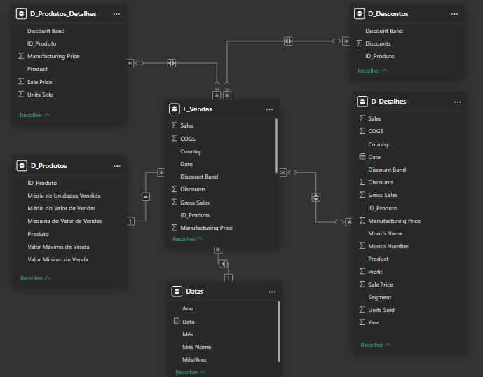

# Desafio Star-Schema Power BI - DIO

Projeto para o Desafio de criar um modelo Star-Schema em Power BI, utilizando o modelo de exemplo "financials" como base.


## Processo de Criação
Conforme instruído no desafio, foram criadas planilhas com base na planilha de exemplo original "financials" do próprio Power BI.

D_Produtos: Duplicada de financials e agregada por produtos, trazendo Média de Unidades Vendidas, Médias do valor de vendas, Mediana do valor de vendas, Valor máximo de Venda, Valor mínimo de Venda e um índice como ID_Produto.

D_Produto_Detalhe: Duplicada de financials, possui apenas dados de venda dos produtos, sem agregação, com a coluna ID_Produto mesclada da tabela D_Produtos.

D_Descontos: Duplicada de financials, possui apenas dados envolvendo descontos dos produtos, sem agregação, com a coluna ID_Produto mesclada da tabela D_Produtos.

D_Detalhes: Duplicada de financials, possui todos os dados com inclusão da coluna ID_Produto, mesclada da tabela D_Produtos.

Datas: Planilha de datas feita através da seguinte sintaxe DAX:
```Datas = ADDCOLUMNS(
    CALENDAR(
        DATE(2013,1,1), DATE(2014,12,31)),
        "Ano", YEAR([Date]),
        "Mês", MONTH([Date]),
        "Mês Nome", FORMAT([Date], "MMMM"),
        "Mês/Ano", FORMAT([Date], "YYYY-MM")
)
```

## Imagem do Star-Schema

